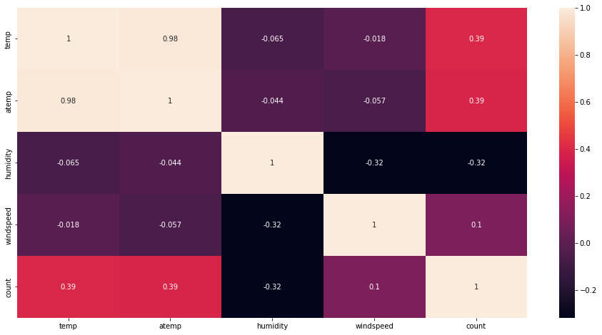
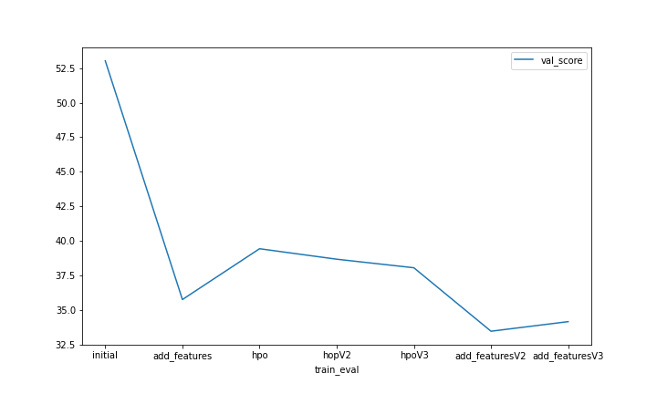
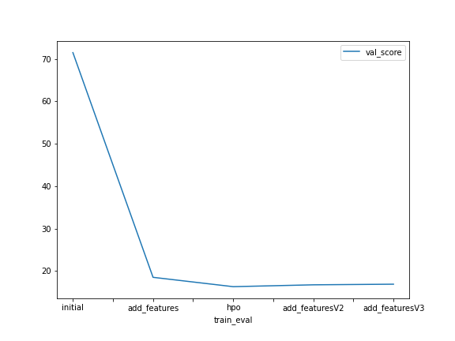

# Report: Predict Bike Sharing Demand with AutoGluon Solution
#### Gasm Elbary M.E

## Initial Training
### What did you realize when you tried to submit your predictions? What changes were needed to the output of the predictor to submit your results?

One can't submit a file with negative values as Kaggle will not accept them. Also, The negative values need to be clarified, as you can't have a negative count for the number of people. So, to fix that, one has to set all negative values, if present, to 0.

### What was the top ranked model that performed?
The top-ranked model for my case was a model I trained after editing the features available, scoring '0.42838'. The changes I made to the features are as follows:
- Split 'datetime' into 'year', 'month', 'day', 'weekday', and 'hour', then drop the 'datetime' column.
- Change the type of 'year', 'month', 'day', 'weekday', 'hour', 'season', 'workinday', 'holiday', and 'weather' columns to Category.
- Drop the 'windspeed' feature as it had a low correlation with the 'count.'
- Drop the 'atemp' column as it is highly correlated to the 'temp' column.

## Exploratory data analysis and feature creation
### What did the exploratory analysis find and how did you add additional features?
During the EDA, I found that:
- Many features like 'season' and 'weather' were treated as integers instead of categories, so I had to change their type.
- It is harder for the models to get information from the 'datetime' column in its current format. That's why it was better to try splitting it into only hours and try, then split it into 'year', 'month', 'day', 'weekday', and 'hour'.
- 'temp' and 'atemp' are highly correlated, so we will drop one of them as they provide the same information. Having two highly correlated columns will act as a weighted feature.
- 'windspeed' has a low correlation with 'count', so we can drop it as it will not add value.

### How much better did your model preform after adding additional features and why do you think that is?
The original model, without new features, scored 1.80676. Then, when I added some features, it performed much better and scored 0.47140. Finally, when I added more features, it performed slightly worse and scored 0.47821. Feature engineering is well-known for improving the quality of models for many reasons, including:
- Features in their current format might be harder to interpret and gain information from.
- Usually, the more features we have, the more information and options a model will have to make predictions.
- Sometimes we can derive more informative features from current columns.

## Hyper parameter tuning
### How much better did your model preform after trying different hyper parameters?
The hyperparameters I tuned are 'num_boost_round', 'num_trials', and 'time_limit'. At the first run I set these parameters to (100, 8, and 660), in the second run (150, 12, 780), and finally to (200,16, and 900). The scores I got were 0.46987, 0.46846, and 0.46966, respectively, scoring bettter than the prior 2 models. However, there are so many options for hyperparameters to tune and many values to accept, and it requires many trials and a long time to test different configurations.

### If you were given more time with this dataset, where do you think you would spend more time?
I would spend more time manipulating and trying to engineer more features. Then, as I see that I reached the best score with the added features, I'll review the model that scored the highest and tune its parameters.

### Create a table with the models you ran, the hyperparameters modified, and the kaggle score.
|model|time_limit|num_boost_round|num_trials|score|
|--|--|--|--|--|
|initial|600|default|default|1.79118|
|add_features|600|default|default|0.47359|
|hpo|660|100|8|0.46987|
|hpoV2|780|150|12|0.46846|
|hpoV3|900|200|16|0.46966|
|add_featuresV2|600|default|default|0.42838|
|add_featuresV3|600|default|default|0.51985|
   
### Create a line plot showing the top model score for the three (or more) training runs during the project.

### Create a line plot showing the top kaggle score for the three (or more) prediction submissions during the project.

## Summary
14,16,20,22,25,16,16
1.79118, 0.47359, 0.46987, 0.46846, 0.46966,0.42838,0.51985

In the beginning, I trained the Autogluon model using the nine available features. Autogluon trained 14 models, and the model 'WeightedEnsemble_L3' ranked the best, which scored '1.79118' on Kaggle. Then for better dataset formatting, I changed the type of the columns that are supposed to be categorical but treated as integers to represent what they actually are. And, split the datetime column into 'year', 'month', 'day', and 'hour' as the original column format needs to be more informative for the model. Autogluon trained 16 models this time, and the best model was the same 'WeightedEnsemble_L3'. This time, the score improved significantly, scoring '0.47359'. 

After that, I tried tuning 3 of the hyperparameters with 3 different configurations; The score improved in all configuration compared to the initital 2 models, scoring '0.46987', '0.46846', and '0.46966', respectively. The best model was "WeightedEnsemble_L3" in three configurations. The hyperparameters I tuned are 'num_boost_round', 'num_trials', and 'time_limit'. At the first run I set these parameters to (100, 8, and 660), in the second run (150, 12, 780), and finally to (200,16, and 900). I believe the model started to overfit after the third run of hpo since the training score decreased but the kaggle score increased slightly. There are plenty of hyperparameters to tune, and it is harder to tune more than one simultaneously.

After that, I added a 'weekday' feature using the datetime column, and after looking at the correlation matrix of the features, I found that 'windspeed' can be dropped as it doesn't correlate with the target. Also, I found that 'atemp' and 'temp' are highly correlated, so I can drop one of them. Moreover, I one-hot encoded "season", "weather", and "weekday" columns for better representation of categorical variables. Applying these changes, I scored the best '0.42838'. Autogluon trained 16 models this time, and the best model was 'WeightedEnsemble_L3'.

Finally, I categorized  'hour' to column 'rush_hour', where:
    - morning_rush: 7-9am (7-9)
    - lunch_ruch: 11am-1pm (11-13)
    - evening_rush: 5-6pm (17-19)
    - no_rush: any time else
    
and 'temp' to column 'temp_categorized', where:
    - Cold = <10 C
    - mild = 10-20 C
    - warm = 20-30 C
    - hot = >30 C
    
Then I one-hot encoded 'rush_hour' and 'temp_categorized'; however, unfortunately I scored '0.51985' which is second worse score. I believe this happened because my choice of splits wasn't the best. I'll need to split these columns using different configurations.

In the end, to improve the score more, I would spend more time on the EDA and engineering more features, then tune the hyperparameters of the specific best-performance algorithm to improve the score. So far, the best model has always been 'WeightedEnsemble_L3', but with more features, it might change.

## References:
https://auto.gluon.ai/stable/api/autogluon.predictor.html
https://auto.gluon.ai/stable/tutorials/tabular_prediction/tabular-indepth.html?#specifying-hyperparameters-and-tuning-them
